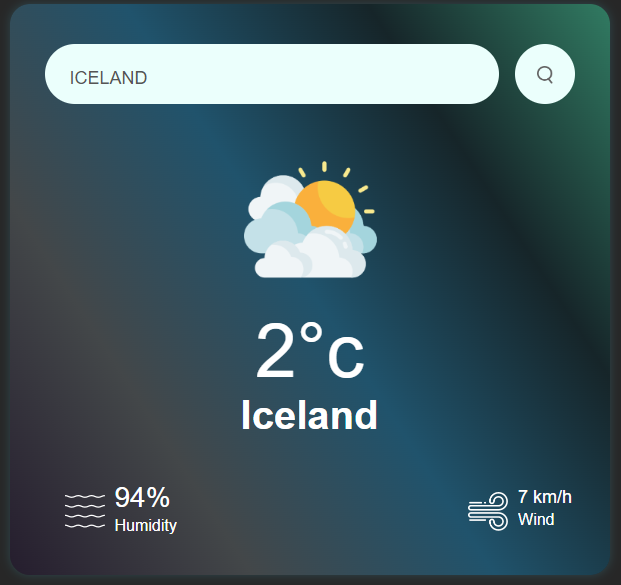

# Weather App - Check Current Weather

## Introduction

The Weather App is a lightweight web application designed to provide users with up-to-date weather information. Built using HTML5, CSS3, and JavaScript, it offers a seamless and responsive experience across various devices.

## Features

- Accurate and real-time weather data
- User-friendly interface for easy navigation
- Search by location name or zipcode
- Fully responsive design for optimal viewing on all devices

## Usage

To use the Weather App:

1. Clone or download this repository.
2. Open the `index.html` file in your preferred web browser.
3. Enter the location name or zipcode and click "Search".

## SEO Optimization

The Weather App has been developed with SEO in mind to ensure better visibility on search engines. The following SEO practices have been implemented:

- **Descriptive Title**: The title clearly reflects the purpose of the application.
- **Alt Text for Images**: All images, including the screenshot, have descriptive alt text for accessibility and SEO.
- **Keyword Usage**: Relevant keywords like "Weather App", "Current Weather", and "Weather Check" have been strategically placed in headings and descriptions.
- **Meta Tags**: Meta tags have been optimized for search engine crawlers.
- **Responsive Design**: The app is fully responsive, providing a better user experience and potentially improving SEO rankings.

## Screenshots

## Contributing

If you would like to contribute to the development of this project, please follow the [contribution guidelines](CONTRIBUTING.md).

## License

This project is licensed under the [MIT License](LICENSE).

---

For more information, visit our [website](https://www.weatherapp.com) or contact us at info dailylifemalikbilal@gmail.com.
